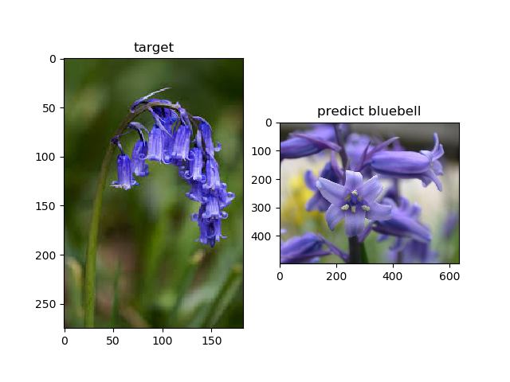

# Flower Recognition

Using **Keras**'s buildin applications, pretrained models to make **Flower Recognition**.


what pretained models?

- VGG16
- VGG19
- ResNet50
- InceptionV3
- InceptionResNetV2
- Xception
- MobileNet
- DenseNet121
- DenseNet169
- DenseNet201
- NASNetLarge
- NASNetMobile

## Dependencies

- python3.6
- tensorflow
- keras
- h5py
- matplotlib
- pillow
- scikit-learn
- seaborn

> execute this command to install dependencies.
> ```shell
>    pip install -r requirements.txt
> ```

## Datasets

University of Oxford's [FLOWERS17](http://www.robots.ox.ac.uk/~vgg/data/flowers/17/index.html) and [FLOWERS102](http://www.robots.ox.ac.uk/~vgg/data/flowers/102/index.html) dataset.

execute below commands to download the dataset.

```shell
wget -d http://www.robots.ox.ac.uk/~vgg/data/flowers/17/17flowers.tgz ./dataset/
tar zxvf ./dataset/17flowers.tgz -C ./dataset/
mv ./dataset/jpg ./dataset/17flowers

wget -d http://www.robots.ox.ac.uk/~vgg/data/flowers/102/102flowers.tgz ./dataset/
tar zxvf ./dataset/102flowers.tgz -C ./dataset/
mv ./dataset/jpg ./dataset/102flowers

wget -d http://www.robots.ox.ac.uk/~vgg/data/flowers/102/imagelabels.mat ./dataset/102flowers
```

execute below commands to preprocess the dataset

```shell
python preprocess_17flowers.py
python preprocess_102flowers.py
```

## Usage

### Config File

`config.py` is the file that store all configurable value.

### Extract Features

configure `model_name='VGG16'` and `dataset_name='17flowers'`

and execute below command to extract features by using pretrained model.

```shell
python extract_features.py
```

output:

- `./output/17flowers/VGG16/features.h5`
- `./output/17flowers/VGG16/labels.h5`

### Train, Test and Evaluate

```shell
python train_test_and_evaluate.py
```

output:

- `./output/17flowers/VGG16/classifier.pickle`
- `./output/17flowers/VGG16/summary.txt`

### Visual Predict

google some image and save it into `./dataset/predict_targets`,
execute the command and you will see the recogintion result.

```shell
python predict.py
```




## Summary

### Models Summary (include_top=False, pooling='avg')

| model name        | input(image) size | output(feature) size | weights size | depth | total params |
|-------------------|-------------------|----------------------|--------------|-------|--------------|
| VGG16             | (224, 224)        | 512                  | 57M          | 20    | 14714688     |
| VGG19             | (224, 224)        | 512                  | 77M          | 23    | 20024384     |
| ResNet50          | (224, 224)        | 2048                 | 91M          | 168   | 23587712     |
| InceptionV3       | (299, 299)        | 2048                 | 84M          | 158   | 21802784     |
| InceptionResNetV2 | (299, 299)        | 1536                 | 209M         | 571   | 54336736     |
| Xception          | (299, 299)        | 2048                 | 80M          | 125   | 20861480     |
| MobileNet         | (224, 224)        | 1024                 | 17M          | 97    | 3228864      |
| DenseNet121       | (224, 224)        | 1024                 | 29M          | 427   | 7037504      |
| DenseNet169       | (224, 224)        | 1664                 | 51M          | 595   | 12642880     |
| DenseNet201       | (224, 224)        | 1920                 | 73M          | 707   | 18321984     |
| NASNetLarge       | (331, 331)        | 4032                 | 328M         | 275   | 84916818     |
| NASNetMobile      | (224, 224)        | 1056                 | 20M          | 209   | 4269716      |

### Evaluate Summary

1. dataset_name='17flowers', test_size=0.1, seed=0, n_splits=10

    | model name        | Rank-1 Accuracy | Rank-5 Accuracy | Cross-Validation score |
    |-------------------|-----------------|-----------------|------------------------|
    | VGG16             | 90.44%          | 99.26%          | (93.41 +/- 3.37)%      |
    | VGG19             | 94.12%          | 100.00%         | (93.01 +/- 5.05)%      |
    | ResNet50          | 96.32%          | 100.00%         | (95.04 +/- 4.21)%      |
    | InceptionV3       | 97.79%          | 99.26%          | (95.04 +/- 3.45)%      |
    | InceptionResNetV2 | 96.32%          | 100.00%         | (92.52 +/- 3.40)%      |
    | Xception          | 97.06%          | 100.00%         | (95.37 +/- 3.99)%      |
    | MobileNet         | 95.59%          | 98.53%          | (96.91 +/- 3.07)%      |
    | DenseNet121       | 95.59%          | 100.00%         | (96.10 +/- 2.50)%      |
    | DenseNet169       | 97.79%          | 99.26%          | (96.91 +/- 2.80)%      |
    | DenseNet201       | 94.85%          | 100.00%         | (97.40 +/- 1.90)%      |
    | NASNetLarge       | 87.50%          | 98.53%          | (84.31 +/- 5.91)%      |
    | NASNetMobile      | 85.29%          | 96.32%          | (85.04 +/- 4.49)%      |

2. dataset_name='102flowers', test_size=0.1, seed=0, n_splits=10

    | model name        | Rank-1 Accuracy | Rank-5 Accuracy | Cross-Validation score |
    |-------------------|-----------------|-----------------|------------------------|
    | VGG16             | 90.35%          | 98.53%          | (89.01 +/- 2.68)%      |
    | VGG19             | 89.38%          | 98.53%          | (88.94 +/- 1.92)%      |
    | ResNet50          | 97.44%          | 99.76%          | (96.21 +/- 1.47)%      |
    | InceptionV3       | 92.92%          | 98.53%          | (92.27 +/- 1.84)%      |
    | InceptionResNetV2 | 93.53%          | 98.90%          | (91.95 +/- 2.20)%      |
    | Xception          | 92.43%          | 98.78%          | (92.48 +/- 1.56)%      |
    | MobileNet         | 95.24%          | 99.39%          | (94.84 +/- 1.01)%      |
    | DenseNet121       | 95.36%          | 99.39%          | (95.55 +/- 1.50)%      |
    | DenseNet169       | 97.07%          | 99.15%          | (96.19 +/- 1.65)%      |
    | DenseNet201       | 97.07%          | 99.63%          | (96.55 +/- 1.85)%      |
    | NASNetLarge       | 84.00%          | 96.70%          | (82.50 +/- 2.38)%      |
    | NASNetMobile      | 76.68%          | 93.04%          | (76.00 +/- 1.72)%      |
